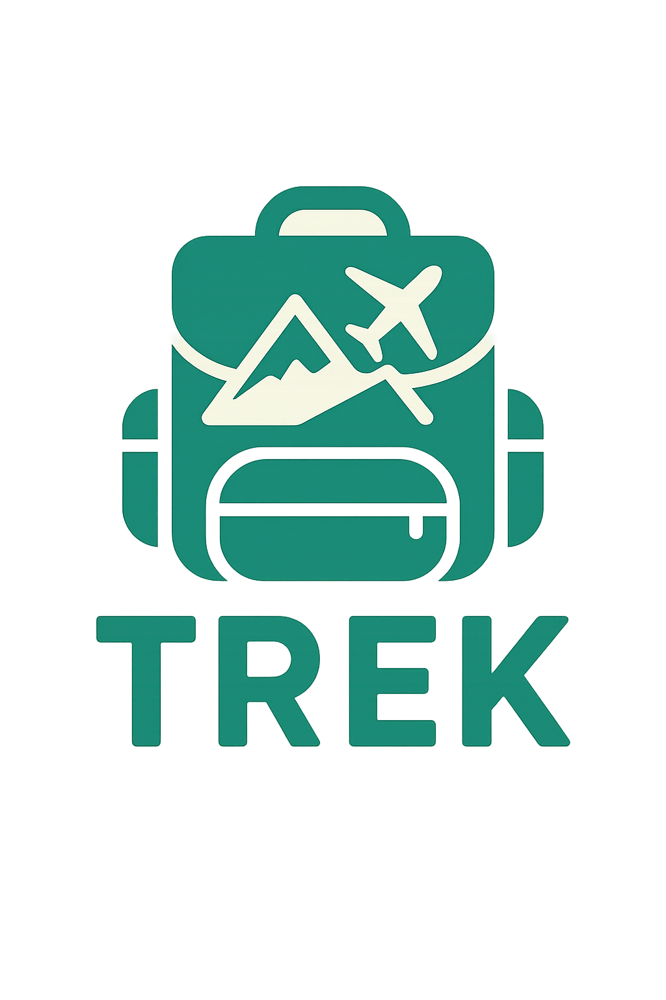

# Trek 🧭

**Trek** is a smart tourism mobile app built with Flutter. It aims to recommend personalized places and generate trip roadmaps based on user preferences and answers to a short questionnaire. The app includes login, interest selection, and dynamic place recommendations.

---

## ✨ Features

- 🔐 User registration and login.
- 🏷️ Select interests (tags & categories) upon first use.
- 🧠 Personalized place recommendations & smart **warnings** based on user preferences.
- 📄 View detailed information about places.
- ❤️ Save favorite places with **offline caching**.
- 🙍‍♂️ User profile with the ability to update interests.
- 🗺️ **Core Feature**: Trip planner that generates a roadmap of 10 places based on 5 questions:
  1. Select up to 3 cities.
  2. Choose your travel date.
  3. Choose travel group type (solo, couple, friends, family).
  4. Specify any accessibility needs.
  5. Select your budget (low, medium, high).
- 🧑‍🤝‍🧑 Community feature is planned for future development.

---

## 🧑‍💻 Technologies Used

- **Language**: Dart
- **Framework**: Flutter
- **Architecture**: Clean Architecture (without domain layer, repositories are inside the data layer)
- **State Management**: [BLoC](https://bloclibrary.dev/)
- **Routing**: [go_router](https://pub.dev/packages/go_router)
- **Network**: [Dio](https://pub.dev/packages/dio)
- **Local Storage**: [Shared Preferences](https://pub.dev/packages/shared_preferences)
- **UI & Animations**:
  - [Lottie](https://pub.dev/packages/lottie)
  - [Animated Bottom Navigation Bar](https://pub.dev/packages/animated_bottom_navigation_bar)
  - [Font Awesome Flutter](https://pub.dev/packages/font_awesome_flutter)
  - [Cached Network Image](https://pub.dev/packages/cached_network_image)
  - [Google Fonts](https://pub.dev/packages/google_fonts)
- **Dependency Injection**: [get_it](https://pub.dev/packages/get_it)
- **Others**: Equatable, Dartz, Image Picker

---

## 📁 Project Structure (Simplified)

```
lib/
├── features/
│   ├── auth/           # 🔐 Authentication Module
│   │                   # Handles user login & registration flows
│   │
│   ├── explore/        # 🗺️ Place Discovery
│   │                   # Location recommendations and search
│   │
│   ├── roadmap/        # 🛣️ Trip Planning
│   │                   # Intelligent trip roadmap generator
│   │
│   └── profile/        # 👤 User Management
│                       # User profile and settings
│
├── core/
│   ├── utils/          # 🛠️ Utilities & Helpers
│   │                   # Common helpers, constants, and extensions
│   │
│   ├── services/       # 🌐 External Integrations
│   │                   # Network layer, API clients, and data services
│   │
│   └── main.dart       # 🚀 Application Entry Point
```

## 🏗️ Architecture Overview

### **Features Layer**
The features directory follows a modular architecture where each feature is self-contained:

- **Authentication** - Complete user authentication flow including login, registration, and session management
- **Explore** - Discovery engine for places and attractions with recommendation algorithms  
- **Roadmap** - AI-powered trip planning that generates optimized travel itineraries
- **Profile** - User account management, preferences, and personalization settings

### **Core Layer**
Shared application infrastructure and cross-cutting concerns:

- **Utils** - Reusable helper functions, constants, extensions, and common widgets
- **Services** - Network abstraction, API clients, data repositories, and external service integrations
- **Main** - Application bootstrap, dependency injection setup, and root widget configuration
  
## 🧼 Clean Architecture Approach

> The app follows a layered architecture with separation between `presentation` and `data`. No dedicated `domain` layer.

### **Architecture Layers:**

- **Presentation Layer** - UI components, state management, and user interaction logic
- **Data Layer** - Repository patterns, API clients, and data source abstractions
- **Simplified Approach** - Streamlined without domain layer for faster development cycles

---

## 🚧 Project Status

- ✅ Core functionalities implemented.
- 🚀 Scalable for future development.
- 🧱 Community section is under development.

---

## 🚀 Getting Started

### Prerequisites

* Flutter SDK >= 3.7
* Dart >= 3.0
* A connected device or emulator

### Installation

```bash
git clone https://github.com/3bary/trek.git
cd trek
flutter pub get
```

### Running the App

```bash
flutter run
```

> The app communicates with two REST back-ends (core & recommendation).  
> You can change the base URLs in `lib/core/network/*_api_service.dart`.

---

## 🗺️ Roadmap

- 🌍 **Multi-language** support
- 🔔 Push notifications for upcoming trip steps
- 🧑‍🤝‍🧑 Community sharing & trip collaboration

---

## 🤝 Contributing

1. Fork the repository
2. Create your feature branch `git checkout -b feat/awesome-feature`
3. Commit your changes `git commit -m 'feat: add awesome feature'`
4. Push to the branch `git push origin feat/awesome-feature`
5. Open a Pull Request

Please make sure your code follows the project style guidelines and is properly documented.

---

## 👨‍💻 Contributors

- [@3bary (Mohamed Ashraf)](https://github.com/3bary) – as Flutter App Developer & UI/UX Designer  
- [@Ahlamgomaa (Ahlam Gomaa)](https://github.com/Ahlamgomaa) – as Flutter App Developer

---

## 📜 License

This project is licensed under the **Creative Commons Attribution-NonCommercial-NoDerivatives 4.0 International License**.

You are allowed to view and share the code for personal and educational use only.  
You are **not allowed** to use it commercially, or modify and redistribute it without the author's permission.

[Read full license terms here](https://creativecommons.org/licenses/by-nc-nd/4.0/)
---

## 🎥 Project Preview
[](https://youtube.com/shorts/y65VX9CWccc?feature=share)
